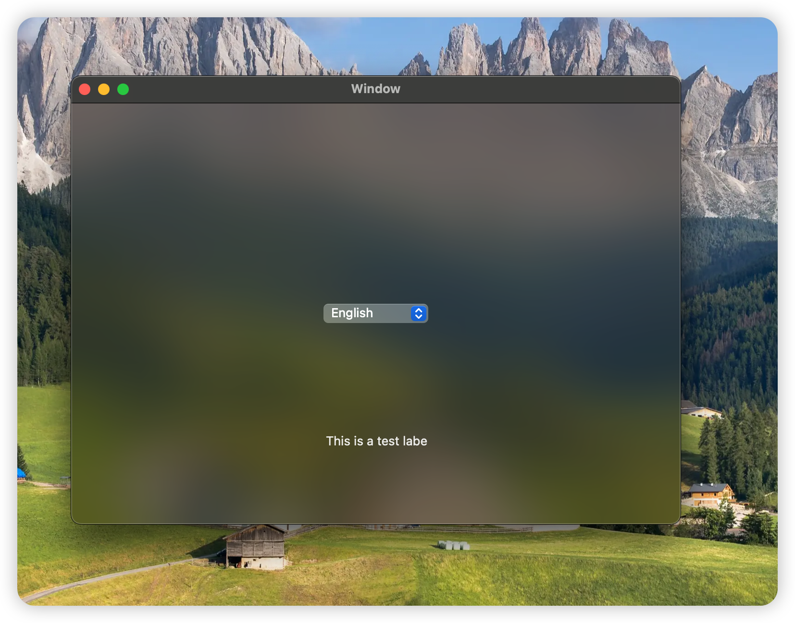
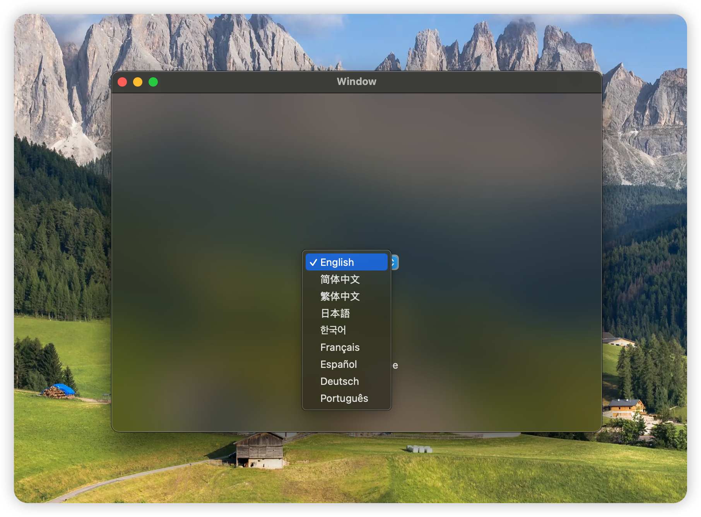
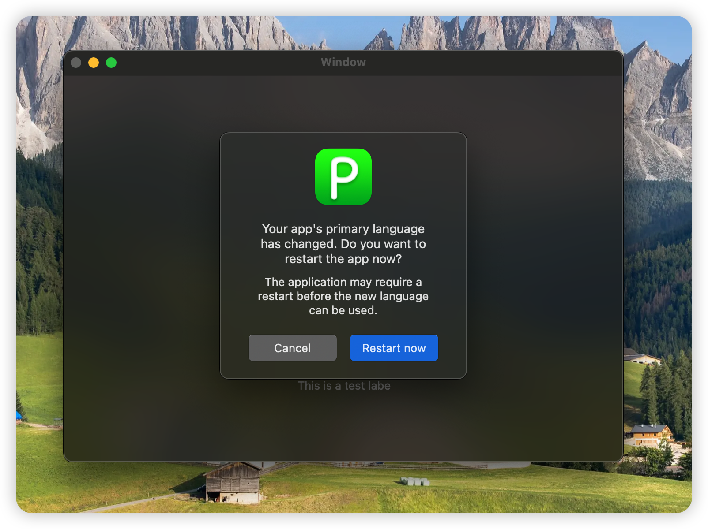
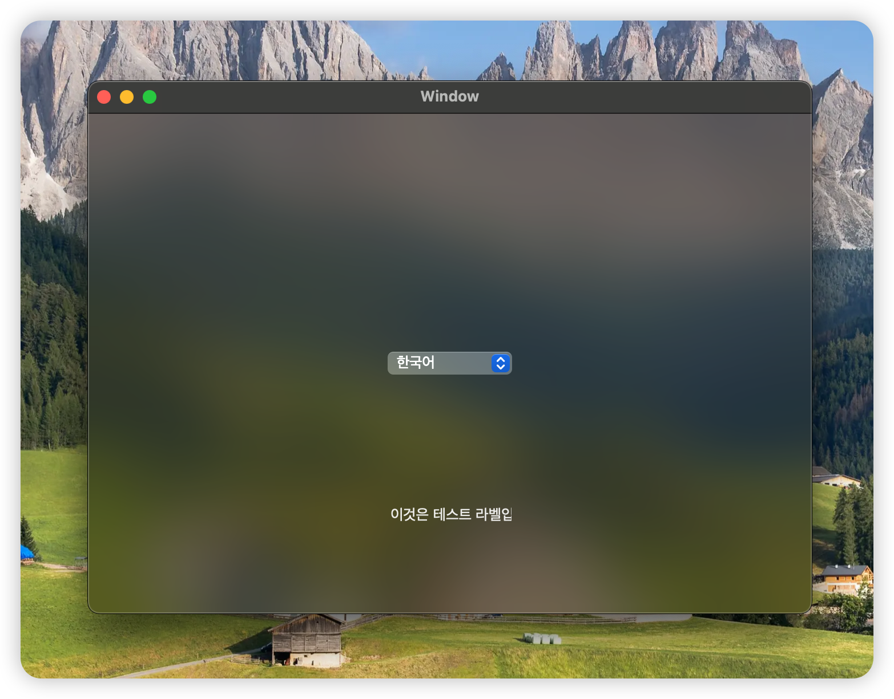
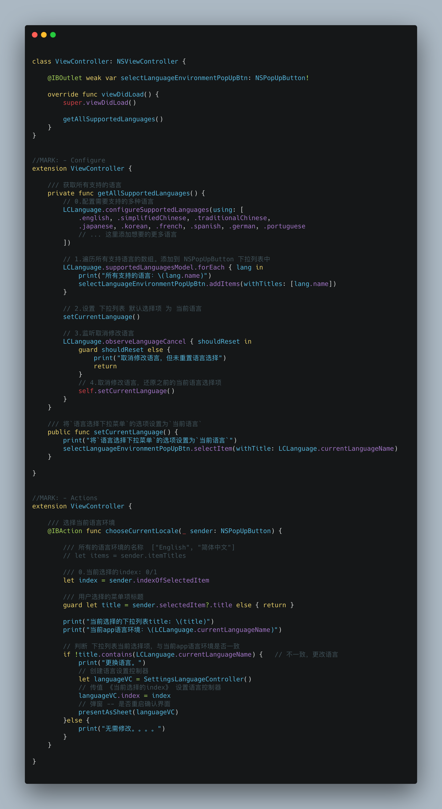

<p align="center"> <b>LCLanguage 是一个轻量级的 Cocoa 框架，专为 macOS 应用提供语言环境切换功能。它通过下拉菜单让用户轻松选择应用语言，支持自定义多种语言选项，并实现无缝切换。</b></p>

<p align="center">


<a href="https://twitter.com/LiuChuan_"></a>
</p>


> [中文](README_CN.md) | [English](README.md)


## 预览

| **预览 1** | **预览 2** |
|:---|:--- |
|  | |


| **预览 4** | **预览 5** |
|:---|:--- |
|  | |


## 用法



## 安装方式

### CocoaPods
LCLanguage 可通过 [CocoaPods](https://cocoapods.org) 获取。要安装它，只需将以下行添加到您的 Podfile 中：


```swift
pod 'LCLanguage'
```


### SwiftPackage
添加 `https://github.com/DevLiuSir/LCLanguage.git `  [Xcode 中的“Swift Package Manager”选项卡](https://developer.apple.com/documentation/xcode/adding_package_dependencies_to_your_app).


## 许可证

MIT License

Copyright (c) 2024 Marvin


## 作者

| [](https://github.com/DevLiuSir)  |  [DevLiuSir](https://github.com/DevLiuSir)<br/><br/><sub>Software Engineer</sub><br/> [][1] [][2] [][3]|
| :------------: | :------------: |

[1]: https://twitter.com/LiuChuan_
[2]: https://github.com/DevLiuSir
[3]: https://devliusir.com/

